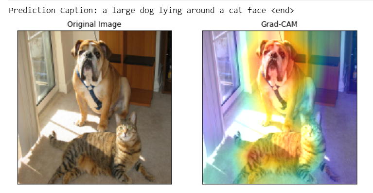
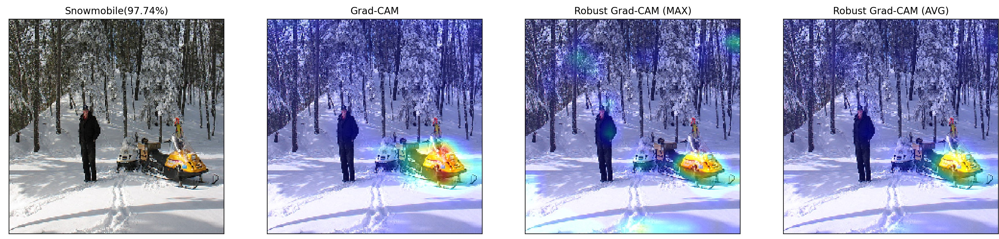

# Explanations-using-GradCAM
Reimplimentation of the paper - Grad-CAM: Visual Explanations from Deep Networks via Gradient-based Localization

conda create --name <env> --file requirements.txt

## RESULTS
### Grad-CAM and Grad-CAM++ visualisations
</img>
### Counterfactual Explanations using Grad-CAM
</img>
### Image Captioning visualisations using Grad-CAM
</img> 
</img>
</img>
### Effect of adveserial noise on Grad-CAM
</img>
### Robust Grad-CAM
</img>
### Mode Collapse detection using Grad-CAM
</img>
</img>
